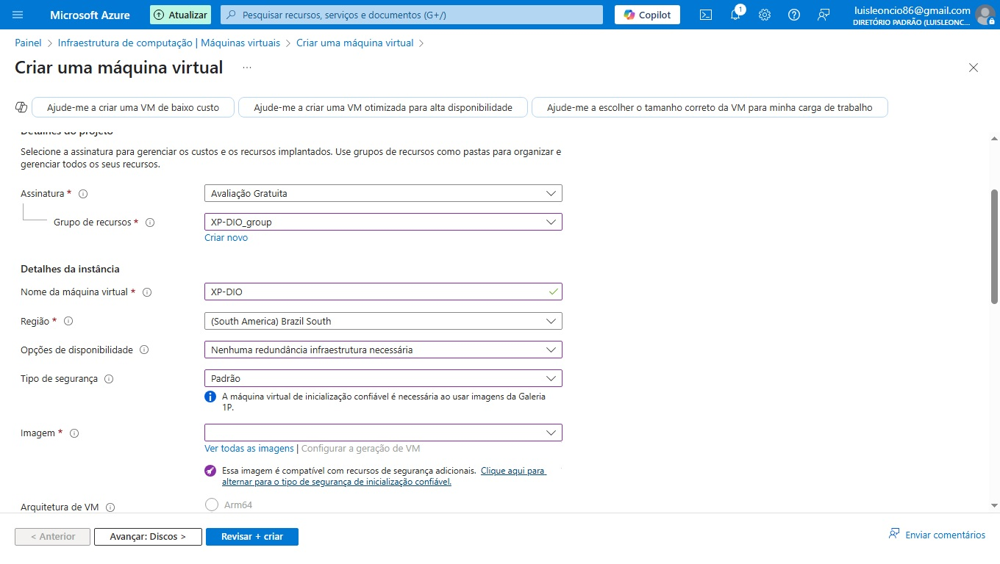

# 💻 Desafio Bootcamp DIO - Criação de VM no Azure

Este repositório documenta a atividade prática do bootcamp da DIO, que consistiu na criação de uma Máquina Virtual (VM) no Microsoft Azure. A atividade teve como objetivo desenvolver habilidades básicas em computação em nuvem, usando o portal do Azure para configurar e provisionar uma VM.

---

## 🧭 Passo a Passo para Criar a VM no Azure

1. **Acessar o Portal do Azure**  
   Entre no [portal.azure.com](https://portal.azure.com) com sua conta Microsoft.

2. **Criar um novo recurso**  
   Clique em **"Criar um recurso"** e selecione **"Máquina virtual"**.

3. **Preencher os dados básicos**:
   - **Assinatura**: Use a padrão (ex: Gratuita).
   - **Grupo de recursos**: Crie um novo (ex: `grupo-vm-dio`).
   - **Nome da VM**: `XP-DIO`
   - **Região**: `South America (Brazil South)`
   - **Imagem**: `Windows Server 2022 Datacenter`
   - **Tamanho**: `Standard_B1s (1 vCPU, 1 GiB RAM)`
   - **Usuário e senha**: Defina suas credenciais de acesso.
   - **Porta de entrada pública**: Habilite a porta `3389` ou configure o acesso por **SSH**.

4. **Discos**  
   Escolha o tipo de disco: **SSD Premium**.

5. **Rede**  
   Mantenha as configurações padrão.

6. **Opções de gerenciamento**  
   Desabilite o backup e configure monitoramento se desejar.

7. **Revisar e Criar**  
   Revise todas as informações e clique em **"Criar"**.

---

## 📸 Imagem da VM criada

---

## ⚙️ Configurações da VM

| Item | Configuração                            |
|------|------------------------------------------|
| 1️⃣  | Nome: **XP-DIO**                         |
| 2️⃣  | Sistema Operacional: **Windows Server 2022 Datacenter** |
| 3️⃣  | Tamanho: **Standard_B1s - 1 vCPU, 1 GiB RAM** |
| 4️⃣  | Região: **South America - Brazil South** |
| 5️⃣  | Tipo de disco: **SSD Premium**           |
| 6️⃣  | Método de acesso: **SSH**                |
| 7️⃣  | Backup configurado: **Não**              |

---

## 🧠 Observações

- A VM foi criada com configurações mínimas, ideal para fins de estudo e prática.
- O acesso via SSH foi configurado para garantir maior segurança.
- Nenhum backup foi habilitado para esta máquina.

✅ **Atividade concluída com sucesso!**

